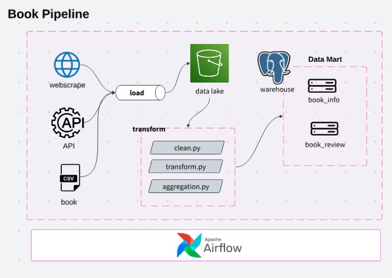

# Books Pipeline

This project demonstrates ETL pipeline to extract book data from multiple sources for analysis purpose. Extraction, transformation, and loading occur montly in providing behaviour change in consumer book review and update on new books. 

**(Disclaimer: Data used for educational purpose)**

**Project aim:**
- Update on new book.
- Review on book.

## Pipeline design 

- Arhitecture design: Batch layer
- Extraction time: Monthly
- Destination: S3, PostgresSQ

### Tools
- Data: Amazon, CSV, Goodreads
- Data Lake: S3
- Data Warehouse: PostgreSQL
- Language: Python, SQL
- Orchestration: Airflow
- Container: Docker

## Data Ingestion

Extraction of data from mulitple sources of websites and file. 

#### Data staging (Transformation)

Data transformation from 1NF to 3NF to extract knowledge

**Data Schema**

